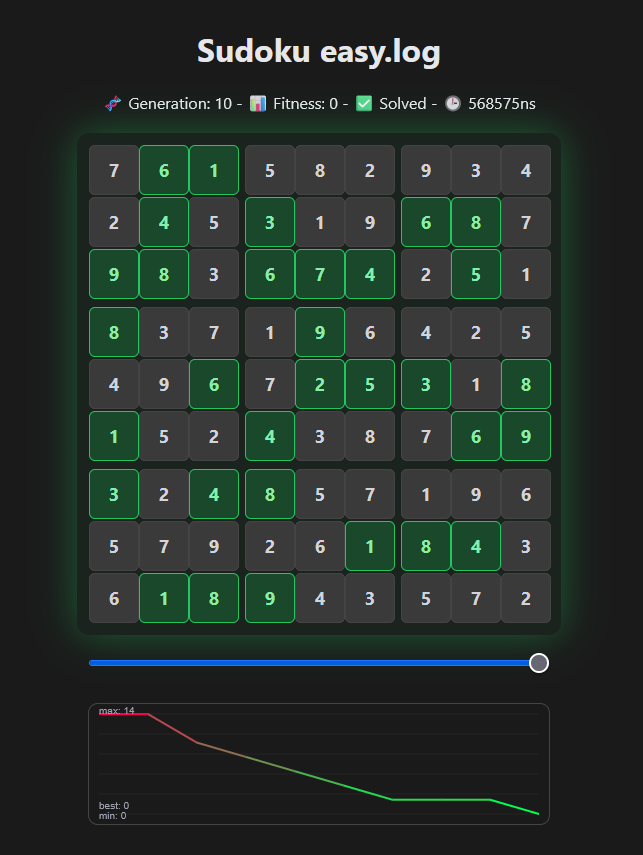

# Live-Sudoku-UI

Die Ausführung des genetischen Sudokus Solvers kann erweiternd zu den Konsolenausgaben auch visuell aufbereitet im Browser betrachtet werden.
Das Tool visualisiert den Fortschritt der Generationen, Zellkonflikte und den Fitness-Verlauf.

::: details Beispielhaftes Preview für ein einfaches, gelöstes Sudoku.

:::

## Featurebeschreibung

- **Live-Metriken:** Anzeige von 🧬 Generation, 📊 aktueller Fitness, ⚠️ Konflikten und 🕒 vergangener Zeit.
  
- **Menschenlesbare Darstellung:** Das jeweils beste Individuum der aktuellen Generation wird übersichtlich im 9x9 Gitter visualisiert.
  
- **Replay-Funktion:** Über einen interaktiven Slider kann durch bereits vergangene Generationen navigiert werden.
  
- **Fitness-Diagramm:** Der Verlauf der Fitness-Werte über alle Generationen hinweg wird in einem dynamischen Diagramm gezeichnet.
  
- **Fehler-Highlighting:** Zellkonflikte innerhalb des Sudokus werden gelb hervorgehoben.
    ::: tip HINWEIS
    Wenn die Lösung des Sudokus bekannt ist, werden fehlerhafte Zellen rot ❌ und korrekte Zellen grün ✅ markiert, anstatt nur allgemeine ⚠️ Zellkonflikte anzuzeigen.
    :::

    ::: details Lösung vorab an das UI übergeben
    Sollte die Lösung des Sudokus bereits vorab bekannt sein, kann diese vor dem Start des eigentlichen Algorithmus im Testbench-Code ausgegeben werden. Die Bridge extrahiert diese Lösung automatisch und sendet sie an das UI.

    ```vhdl
    hs_solved := (
            (7, 6, 1,   5, 8, 2,   9, 3, 4),
            (2, 4, 5,   3, 1, 9,   6, 8, 7),
            (9, 8, 3,   6, 7, 4,   2, 5, 1),

            (8, 3, 7,   1, 9, 6,   4, 2, 5),
            (4, 9, 6,   7, 2, 5,   3, 1, 8),
            (1, 5, 2,   4, 3, 8,   7, 6, 9),

            (3, 2, 4,   8, 5, 7,   1, 9, 6),
            (5, 7, 9,   2, 6, 1,   8, 4, 3),
            (6, 1, 8,   9, 4, 3,   5, 7, 2)
        );

    report "[Bridge] Sudoku Solution:";
    print_sudoku(hs_solved);
    ```

    *Auszug aus `/test/ga_sudoku/ga_sudoku_easy_tb.vhd`.*
    :::

## Schritt-für-Schritt Anleitung

### Datenstruktur

Die beteiligten Dateien befinden sich im Projektverzeichnis unter:

```
/test/ga_sudoku/
├─ sudoku_ui.html       # Das Frontend (Benutzeroberfläche im Browser)
├─ sudoku_bridge.js     # Der Node.js-Server (WebSocket-Bridge)
└─ [Optionale .log-Dateien]
```

### 1. Starten der Bridge und des WebSockets: `sudoku_bridge.js`

Die Datei `sudoku_bridge.js` dient als Brücke zwischen Simulation und Benutzeroberfläche. Sie liest die `.log`-Dateien einer Simulation ein und sendet die Daten per WebSocket an die Benutzeroberfläche. Der `node`-Server kann in Terminal wie folgt gestartet werden:

```bash
node test/ga_sudoku/sudoku_bridge.js
```

::: tip Log-Pfad anpassen

Standardmäßig sucht die Bridge im eigenen Verzeichnis nach Log-Dateien.
Es kann optional einen spezifischen Pfad zum Zielordner übergeben, in dem die Log-Dateien liegen oder generiert werden:

```bash
node test/ga_sudoku/sudoku_bridge.js [Pfad_zum_Log_Ordner]
```

:::

### 2. Öffnen der Benutzeroberfläche: `sudoku_ui.html`

- Öffne die Datei `sudoku_ui.html` in einem beliebigen Webbrowser.
- Nach dem Laden versucht die Seite automatisch, eine Verbindung zu dem lokal laufenden WebSocket herzustellen.
- Gib im Startbildschirm den Namen der Log-Datei ein (z. B. easy.log), die überwacht werden soll.

### 3. Starten der Simulation: `.log`

Nun kann der eigentliche genetischen Algorithmus gestartet und die Konsolenausgabe direkt in die Ziel-Logdatei umgeleitet werden:

```bash
./run.sh ga_sudoku_easy_tb 1000ms | tee test/ga_sudoku/easy.log
```

Sobald die Simulation läuft und die Bridge mit dem UI verbunden ist, aktualisiert sich die Anzeige im Browser bei jedem Generationswechsel automatisch.

> [!WARNING] CACHING-HINWEIS
> Die Bridge cached Teile der Logs, um Anfragen von neu geöffneten Browser-Tabs schneller beantworten zu können. Sollte während der Laufzeit ein *anderes* Sudoku in die *gleiche* Log-Datei geschrieben werden, muss die Bridge neu gestartet werden, um Anzeigefehler zu vermeiden.

::: info Multi-Client Support
Es können problemlos mehrere UI-Instanzen (Browser-Tabs) gleichzeitig geöffnet sein und sogar denselben Log-Stream verfolgen.
:::
