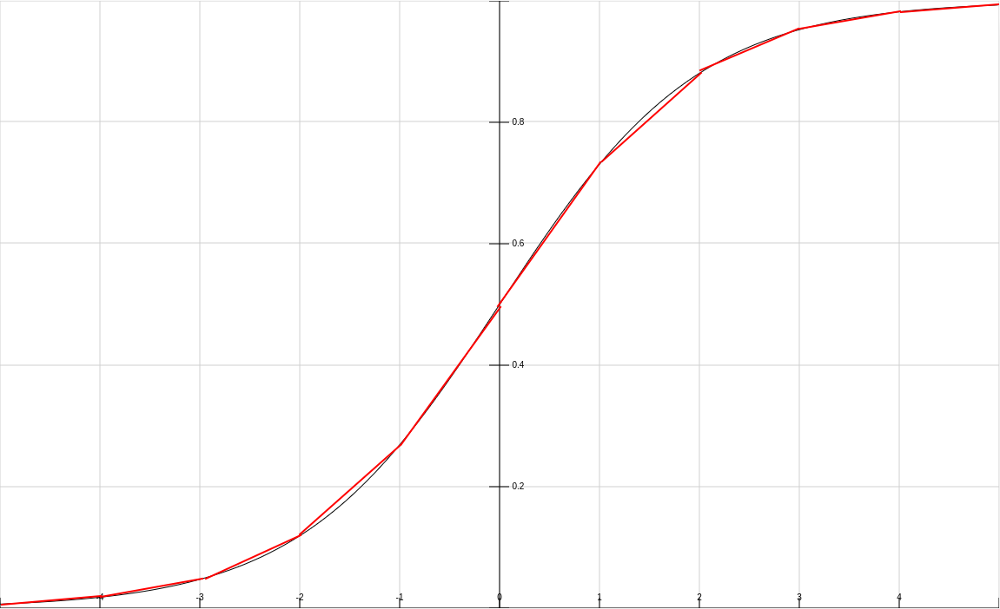

# Auswahl der Algorithmen

Im folgenden wird die Eignung der Algorithmen für eine Hardware-Implementierung untersucht.
Dies basiert auf der groben Funktionsweise der Algorithmen sowie den Vorüberlegungen (Basis-Ideen) zu Beginn des Projekts.

## Supervised

### k-Nearest-Neighbor

- ja, guter erster Kandidat
- größtenteils voneinander unabhängige Berechnungen für verschiedene Datenpunkte
  - gut parallelisierbar
  - Pipelining und Streaming wahrscheinlich auch gut möglich
  - finden bester Kandidaten während Berechnung
- Arithmetik passend
  - Vergleich der Distanzen bei Fixed-Point = Subtraktion
  - Distanzberechnung (euklidisch)
    - Wurzel: Verzicht, da nur Vergleich!
    - Quadrat: entspricht Multiplikation mit sich selbst, möglich
    - Addition, Subtraktion: trivial
- agentenbasiert möglich

### Entscheidungsbäume

- eher nein, zu komplex/dynamisch
- Algorithmus:
  - für jedes Feature den besten Split ermitteln (geringste Gini-Impurity = `1 - p_A^2 - p_B^2 - p`)
    - weitere Komplexität bei nicht-binärer Klassifizierung
  - Aufteilung der Daten nach dem Feature mit dem besten Split
  - für alle Teilmengen wiederholen bis keine Feature übrig (rekursiv)
- zu komplex
  - mehrere Klassen, verschieden viele Features, viele mögliche Splits
  - zu dynamisch (sehr viel Kontrolllogik/Branches statt Berechnungen)
  - viele Speicherzugriffe (unregelmäßig/dynamisch)
    - ständiges Zählen für Features in Teilmengen
    - nicht ausreichend Speicher zum Kopieren der Teilmengen
      - evtl. (Um-)Sortieren und Reduzierung der Speicherzugriffe mit Index-Range (z.B. Feature A mit Index 0-11 und Feature A + B mit Index 0-5)?
      - kein Streaming
      - schlechte Parallelisierung
  - Rekursion (Streaming?)
  - mit Generics zu vereinfachen, aber trotzdem eher unpassend
- agentenbasiert nicht möglich

### Lineare Regression

- ja, guter erster Kandidat
- einheitliche Struktur (y = w1x1 + w2x2 + ... + wnxn + b)
- Trainings-Algorithmus: Gradient Descent
- parallelisierbar
  - alle/mehrere Features zeitgleich
  - mehrere Datenpunkte zeitgleich (Mini-Batching)
- Pipelining möglich:
  - Gewichtung/Multiplikation (w \* x) -> Vorhersage/Addition (evtl. Aufteilung) -> Fehler-Berechnung -> Gewichtsanpassung
- Streaming möglich
  - gleichbleibender Datenfluss, keine Branches
- Arithmetik passend
  - nur Addition und Multiplikation mit Fixed-Point
- agentenbasiert begrenzt möglich, eher nein
  - Aufteilung/Teil-Problem zu klein: z.B. Berechnung für einen Datenpunkt (oder Batch)

### Logistische Regression

- ja, aber später
- entspricht größtenteils Linearer Regression
- aber: Arithmetik nur teilweise passend
  - Exponentialfunktion und Division in Sigmoid (1/(1+e^(-x)))
    - Lookup-Table (Werte speichern)
    - evtl. Linearisierung in Abschnitten
      
    - entspricht dann lediglich Lookup + Multiplikation + Addition
  - Vermeidung von Logarithmus bei Loss-Funktion Binary Cross Entropy Loss
    - Gradient lediglich: `x * (p - y)`
- agentenbasiert begrenzt möglich, eher nein
  - Aufteilung/Teil-Problem zu klein: z.B. Berechnung für einen Datenpunkt (oder Batch)

### Polynomielle Regression

- ja, aber später
- entspricht größtenteils Linearer Regression
- aber: Potenzen mit hohen Exponenten evtl. problematisch, Lösungen:
  - Pipelining (Multiplikation je Stage), sonst evtl. langsam
  - Beschränkung der Eingaben und Grad des Polynoms (Maximum bei Fixed-Point)
    - alternativ Beschränkung der Berechnung (Overflow = Maximum)
- agentenbasiert begrenzt möglich, eher nein
  - Aufteilung/Teil-Problem zu klein: z.B. Berechnung für einen Datenpunkt (oder Batch)

### Super Vector Machines

- eher nein, zu komplex und eher ungeeignet für FPGA
- hohe Komplexität
- zu hoher Speicherbedarf

### Neuronale Netze

- wahrscheinlich ja, aber später (hoher Aufwand)
- Einschränkungen: nur mit Batching für Pipelining
- evtl. hoher Speicherbedarf
- Arithmetik bis auf bestimmte Funktionen (Aktivierung, Loss) ausreichend
  - offen: spezielle Funktionen effizient abbilden?
- gutes Potenzial für Parallelisierung, Pipelining, Streaming
- erster Schritt: Implementierung eines konkreten Anwendungsfalls wie binäre Klassifikation mit BCE + ReLU/Sigmoid
- noch genauer zu untersuchen
- agentenbasiert begrenzt möglich, eher nein
  - Aufteilung/Teil-Problem zu klein: z.B. Berechnung für einen Datenpunkt (oder Batch)

## Optimization

### Simulated Annealing

- eher ja, aber später mit Eischränkungen: Verbesserung evtl. eher gering
- Problem: Zufallszahlen (Lösung LFSR)
- schlechte Parallelisierbarkeit
  - mehrere Prozesse parallel und besten wählen (möglich, aber fraglich, ob sinnvolle Art der Parallelisierung: Ziel?)
  - evtl. Parallelisierung der Evaluations-Berechnung (nur sinnvoll, wenn komplex und parallelisierbar)
  - parallel mehrere Nachbarn berechnen
    - bei Wahl von bestem: Einschränkung der Idee von Simulated Annealing: Verschlechterung wird unwahrscheinlicher -> eher lokales Maximum statt globales finden
    - alternativ: parallel berechnete Nachbarn als Fallback verwenden, wenn abgelehnt (z.B. feste Evaluierungs-Reihenfolge) -> nächste Iteration muss nicht abgewartet werden (sofort bei Ablehnung)
- Streaming/Pipelining schwierig/eingeschränkt
- mehrere Prozesse gleichzeitig starten und besten wählen (fraglich wie bei Parallelisierung)

### Genetische Algorithmen

- ja, aber mit Einschärnkungen
- Probleme:
  - Zufallszahlen: LFSR
  - evtl. hoher Speicherbedarf
  - Auswahl bester Individuen aufwändig (vereinfachte Auswahl, verschiedene Möglichkeiten)
- sehr gute Parallelisierung
  - parallele Anpassung der Population (Mutation, Crossover)
  - parallele Berechnung der Fitness-Funktion
  - Einschränkung: RAM
    - parallele Berechnung mehrerer Kinder/Fitness nicht umgesetzt (aber agentenbasiert möglich)
- agentenbasiert sehr gut möglich (nicht umgesetzt)
  - z.B. Teil-Populationen, Planetensystem

Darüber hinaus haben wir explizit für genetische Algorithmen weiterführende Ideen gesammelt.
Da natürlich nur ein Teil dieser Ideen umgesetzt und nur dieser Teil für die beiden Implementierungen dokumentiert ist,
werden im Folgenden die ursprünglichen Ideen kurz aufgelistet:

- Population = Array von Individuen
  - Individuum = Chromosom
    - Aufteilung in Blöcke/Gene
    - Bitvektor (Aufteilung je nach Variante bei Fitness/Crossover/Mutation)
    - einheitliche Entity, mehrere Architectures (vgl. Interface)

- Ablauf:
  - Fitness berechnen
  - Selektion der besten
  - Crossover von ausgewählten
  - Mutation der Kinder
  - Austausch der Population

- Fitness:
  - Funktion individuell je Problem: liefert Fixed-Point
  - Fitness mit Individuum speichern
    - parallele Berechnung

- Selektion:
  - k-Top (Elite)
  - Tournament: zufällige Teilnehmer, besten auswählen
  - Kombination aus k-Top und Tournament

- Crossover: parallelisierbar
  - generell (ohne Beachtung von Einschränkungen der Chromosome)
    - 1-/n-Punkt-Crossover:
      - n=1: 1. Hälfte von Parent 1, 2. Hälfte von Parent 2
      - n=2: Ausschnitt von Parent 1 übernehmen, den anderen von Parent 2
    - Uniform Crossover
      - je Gen/Bit zufällig Parent bestimmen (Maske)
    - mehrere Parents
  - Permutationen
    - Position-based Crossover
    - Order Crossover

- Mutation: parallelisierbar
  - generell (ohne Beachtung von Einschränkungen der Chromosome)
    - Toggle/Bit-Flip
    - zufällig bestimmte Bereiche ersetzen
    - Addition/Subtraktion
  - Permutationen
    - Swap (innerhalb Chromosom, z.B. Travelling Salesman)
    - Inversion (innerhalb Chromosom, z.B. Travelling Salesman)
    - zufällig bestimmte Bereiche tauschen

- Austausch der Population:
  - Ping-Pong-RAM: A lesen, B schreiben -> danach B lesen, A schreiben -> ...
    - setzt ausreichend RAM voraus
  - kompletter Austausch durch Kinder
    - Variante: k-Top bleiben, Rest austauschen
  - nur einige austauschen:
    - schlechteste, zufällige, Tournament
    - extreme Variante hiervon ist der umgesetzte Steady State Genetic Algorithm für die lineare Regression
  - Teil-Populationen: Planeten/Inseln
    - Migration der besten

- Parallelisierung
  - Population auf mehrere RAM-Blöcke aufteilen
  - je RAM ein "Agent"

- verschiedene Probleme:
  - unterschiedliche Fitnessfunktionen (gleiche Entity, andere Architektur)
    - sehr problem-spezifisch
    - Idee: "Interface"
  - unterschiedliche Crossover-/Mutations-Methoden (gleiche Entity, andere Architektur)
    - Problem-Kategorien: Permutation, "unabhängige" Features
    - Berücksichtigung von Constraints
    - Idee: "Interface"
  - TSP: jede Stadt ein Gen (enthält Position) oder jede Position ein Gen (enthält Stadt)
  - Knapsack: jedes Item ein Gen (enthält Anzahl)
  - Sudoku: jedes Feld ein Gen (enthält Zahl)
  - math. Funktion: jeder Koeffizient ein Gen (enthält FP)

### Swarm Optimization

- ja, guter erster komplexer Kandidat
- sehr gut parallelisierbar
- Partikel parallel berechnen
- Pipelining über mehrere Berechnungsschritte
- evtl. Streaming über zu berechnende Partikel
- agentenbasiert evtl. auch möglich
  - mehrere Start-Prozesse parallel und besten auswählen
  - Teil-Schwärme mit Synchronisation des global besten Ergebnisses

## Reihenfolge

1. lineare Regression
2. k-Nearest-Neighbor, logistische Regression, polynomielle Regression
3. Swarm Optimization
4. Genetische Algorithmen
5. Neuronale Netze
6. Simulated Annealing

## Ausschluss

- Entscheidungsbäume
- Support Vector Machines

## Tatsächliche Implementierungen

1. k-Nearest-Neighbor
2. Genetischer Algorithmus für lineare Regression
3. Genetischer Algorithmus zum Lösen von Sudokus
