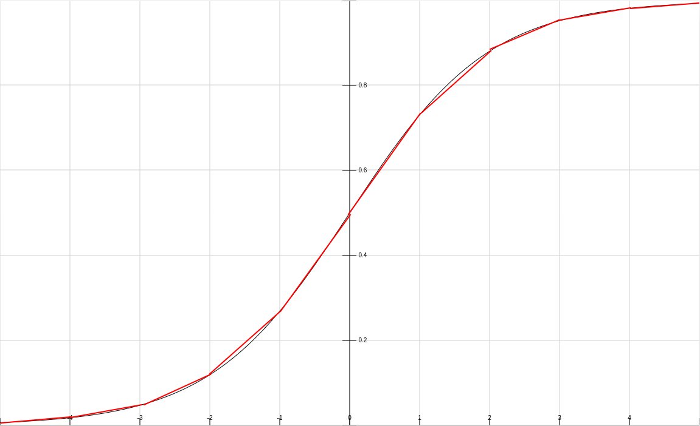

# Auswahl Algorithmen

## Supervised

### k-Nearest-Neighbor
- ja, guter erster Kandidat
- größtenteils voneinander unabhängige Berechnungen für verschiedene Datenpunkte
  - gut parallelisierbar
  - Pipelining und Streaming wahrscheinlich auch gut möglich
  - finden bester Kandidaten während Berechnung
- Arithmetik passend
  - Vergleich der Distanzen bei Fixed-Point = Subtraktion
  - Distanzberechnung (euklidisch)
    - Wurzel: Verzicht, da nur Vergleich!
    - Quadrat: entspricht Multiplikation mit sich selbst, möglich
    - Addition, Subtraktion: trivial

### Entscheidungsbäume
- eher nein, zu komplex/dynamisch
- Algorithmus:
  - für jedes Feature den besten Split ermitteln (geringste Gini-Impurity = `1 - p_A^2 - p_B^2 - p`)
    - weitere Komplexität bei nicht-binärer Klassifizierung
  - Aufteilung der Daten nach dem Feature mit dem besten Split
  - für alle Teilmengen wiederholen bis keine Feature übrig (rekursiv)
- zu komplex
  - mehrere Klassen, verschieden viele Features, viele mögliche Splits
  - zu dynamisch (sehr viel Kontrolllogik/Branches statt Berechnungen)
  - viele Speicherzugriffe (unregelmäßig/dynamisch)
    - ständiges Zählen für Features in Teilmengen
    - nicht ausreichend Speicher zum Kopieren der Teilmengen
      - evtl. (Um-)Sortieren und Reduzierung der Speicherzugriffe mit Index-Range (z.B. Feature A mit Index 0-11 und Feature A + B mit Index 0-5)?
      - kein Streaming
      - schlechte Parallelisierung
  - Rekursion (Streaming?)
  - mit Generics zu vereinfachen, aber trotzdem eher unpassend

### Lineare Regression
- ja, guter erster Kandidat
- einheitliche Struktur (y = w1x1 + w2x2 + ... + wnxn + b)
- Trainings-Algorithmus: Gradient Descent
- parallelisierbar
  - alle/mehrere Features zeitgleich
  - mehrere Datenpunkte zeitgleich (Mini-Batching)
- Pipelining möglich:
  - Gewichtung/Multiplikation (w * x) -> Vorhersage/Addition (evtl. Aufteilung) -> Fehler-Berechnung -> Gewichtsanpassung
- Streaming möglich
  - gleichbleibender Datenfluss, keine Branches
- Arithmetik passend
  - nur Addition und Multiplikation mit Fixed-Point

### Logistische Regression
- ja, aber später
- entspricht größtenteils Linearer Regression
- aber: Arithmetik nur teilweise passend
  - Exponentialfunktion und Division in Sigmoid (1/(1+e^(-x)))
    - Lookup-Table (Werte speichern)
    - evtl. Linearisierung in Abschnitten
    
    - entspricht dann lediglich Lookup + Multiplikation + Addition
  - Vermeidung von Logarithmus bei Loss-Funktion Binary Cross Entropy Loss
    - Gradient lediglich: `x * (p - y)`

### Polynomielle Regression
- ja, aber später
- entspricht größtenteilos Linearer Regression
- aber: Potenzen mit hohen Exponenten evtl. problematisch, Lösungen:
  - Pipelining (Multiplikation je Stage), sonst evtl. langsam
  - Beschränkung der Eingaben und Grad des Polynoms (Maximum bei Fixed-Point)
    - alternativ Beschränkung der Berechnung (Overflow = Maximum)?

### Super Vector Machines
- eher nein, zu komplex und eher ungeeignet für FPGA
- hohe Komplexität
- zu hoher Speicherbedarf

### Neuronale Netze
- wahrscheinlich ja, aber später (hoher Aufwand)
- Einschränkungen: nur mit Batching für Pipelining
- evtl. hoher Speicherbedarf
- Arithmetik bis auf bestimmte Funktionen (Aktivierung, Loss) ausreichend
  - spezielle Funktionen effizient abbilden?
- gutes Potenziel für Parallelisierung, Pipelining, Stream
- erster Schritt: Implementierung eines konkreten Anwendungsfalls wie binäre Klassifikation mit BCE + ReLU/Sigmoid
- noch genauer zu untersuchen

## Optimization

### Simulated Annealing
- eher ja, aber später mit Eischränkungen: Verbesserung evtl. eher gering
- Problem: Zufallszahlen für Nachbar-Lösungen und Bewertung von Verschlechterungen
  - z.B. LFSR?
- schlechte Parallelisierbarkeit
  - mehrere Prozesse parallel und besten wählen (fraglich, ob sinnvolle Art der Parallelisierung: Ziel?)
  - evtl. Parallelisierung der Evaluations-Berechnung (nur sinnvoll, wenn komplex und parallelisierbar)
  - parallel mehrere Nachbarn berechnen
    - bei Wahl von bestem: Einschränkung der Idee von Simulated Annealing: Verschlechterung wird unwahrscheinlicher -> eher lokales Maximum statt globales finden
    - alternativ: parallel berechnete Nachbarn als Fallback verwenden, wenn abgelehnt (z.B. feste Evaluierungs-Reihenfolge) -> nächste Iteration muss nicht abgewartet werden (sofort bei Ablehnung)
- Streaming/Pipelining schwierig/eingeschränkt

### Genetische Algorithmen
- ja, aber später mit Einschärnkungen
- Probleme:
  - Zufallszahlen (wieder LFSR?)
  - evtl. hoher Speicherbedarf
  - Auswahl bester Individuen aufwändig (vereinfachte Auswahl, verschiedene Möglichkeiten)
- sehr gute Parallelisierung
  - parallele Anpassung der Population (Mutation, Crossover)
  - parallele Berechnung der Fitness-Funktion
- 

### Swarm Optimization
- ja, guter erster komplexer Kandidat
- sehr gut parallelisierbar
 - Partikel parallel berechnen
- Pipelining über mehrere Berechnungsschritte
- evtl. Streaming über zu berechnende Partikel

## Reihenfolge
1. lineare Regression
2. k-Nearest-Neighbor, logistische Regression, polynomielle Regression
3. Swarm Optimization
4. Neuronale Netze, Genetische Algorithmen
5. Simulated Annealing

## Ausschluss
- Entscheidungsbäume
- Support Vector Machines
